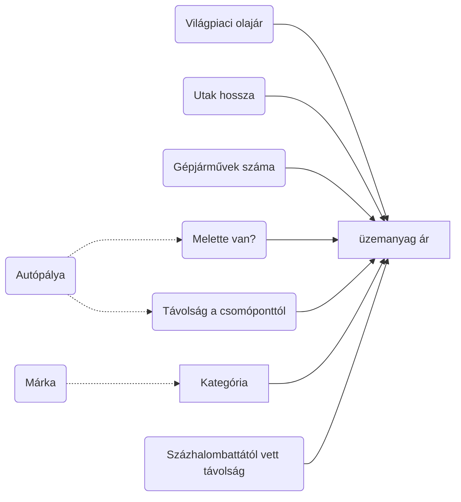

```{r setup, include=FALSE}
knitr::opts_chunk$set(
  echo = TRUE, error = TRUE, dpi = 400, fig.align = "center",
  fig.path = "figures/", dev = c("png", "pdf")
)
```

## Casuality map



```{r}
source("codes/utils.R")
load("data/fuel_df.RData")
load("data/city_df.RData")
load("data/energy_agency_df.RData")
load("data/highway_distance_df")
load("data/crude_df.RData")
load("data/in_distance_df.RData")
load("data/income.RData")

theme_set(
  theme_bw() + 
    theme(
      legend.position = "bottom"
    )
)
```


```{r price_control, fig.width=9}
energy_agency_df %>% 
  pivot_longer(-1, names_to = "fuel", values_to = "price") %>% 
  ggplot() + 
  geom_vline(aes(xintercept = as.Date("2021-11-15"), linetype = "Beginning of price control (2021-11-15)"), color = "orange", size = 1.5) +
  geom_line(aes(time, price, color = fuel)) +
  geom_point(aes(time, price, color = fuel), show.legend = FALSE) + 
  geom_point(data = count(fuel_df, date), aes(x = date, y = 520, fill = "Data sucessfully collected"), shape = 21, color = "purple", alpha = .5) +
  scale_fill_manual(values = "purple") +
  scale_linetype_manual(values = 2) +
  scale_x_date(breaks = scales::date_breaks("months"), labels = ~ NiceMonth(., keep_year = TRUE, label = TRUE)) + 
  labs(fill = NULL, linetype = NULL, color = "Fuel type", x = NULL, y = "Reported average fuel price (Hungrian Forint)")
```

```{r crude_price_raw}
p1 <- crude_df %>% 
  mutate(price_huf = crude_price * usd_huf) %>% 
  pivot_longer(-1) %>% 
  mutate(name = fct_inorder(name)) %>% 
  na.omit() %>% 
  ggplot(aes(time, value)) +
  facet_wrap(~ name, scales = "free_y", ncol = 1, labeller = as_labeller(c("usd_huf" = "US dollar in HUF", "crude_price" = "Crude oil price in US dollar", "price_huf" = "Crude oil price in HUF"))) + 
  geom_line() + 
  scale_x_date(breaks = scales::date_breaks("months"), labels = ~ NiceMonth(., keep_year = TRUE, label = TRUE)) + 
  labs(x = NULL, y = " ")

p1
```


```{r crude_price_index, fig.height=4}
p2 <- crude_df %>% 
  mutate(price_huf = crude_price * usd_huf) %>% 
  slice(-1) %>% 
  mutate_at(-1, ~ . / first(.)) %>% 
  pivot_longer(-1) %>%
  mutate(
    name = fct_inorder(name),
    name = fct_relabel(name, ~ case_when(
      . == "usd_huf" ~ "US dollar in HUF", 
      . == "crude_price" ~ "Crude oil price in US dollar",
      . == "price_huf" ~ "Crude oil price in HUF"
    ))
  ) %>% 
  na.omit() %>% 
  ggplot(aes(time, value, color = name)) + 
  geom_hline(yintercept = 1, lty = 2) +
  geom_line() + 
  scale_x_date(breaks = scales::date_breaks("months"), labels = ~ NiceMonth(., keep_year = TRUE, label = TRUE)) + 
  scale_y_continuous(labels = scales::percent) + 
  labs(x = NULL, y = "2021 jan 4 = 100%", color = NULL)

p2
```


```{r crude_price_combined, fig.height=8}
patchwork::wrap_plots(p1, p2, ncol = 1, heights = c(3, 1))
```


```{r calendar, fig.width=11, fig.height=7}
download_days <- fuel_df %>% 
  pull(date) %>% 
  unique() %>% 
  sort()

Sys.setlocale("LC_TIME", "C") # mac os specific language setup

calendR::calendR(
  start_date = "2021-08-01",
  end_date =  "2022-03-31",
  special.col = "lightblue",
  special.days = download_days - as.Date("2021-07-31"),
  start = "M"
)
```

## EDA

```{r}
fuel_df %>% 
  group_by(address) %>% 
  summarise(date = max(date)) %>% 
  filter(date < "2022-03-07" ) %>% 
  count(date) %>% 
  mutate(n = cumsum(n)) %>% 
  ggplot(aes(date, n)) + 
  geom_line() + 
  geom_point()
```

```{r}
fuel_df
```

```{r}
in_distance_df <- fuel_df %>% 
  filter(date == "2021-11-01" | date == "2021-12-15" | date == "2022-01-15") %>% 
  group_by(date) %>% 
  group_split(.keep = TRUE) %>% 
  map(in_distance, 2) %>% 
  map2_df(c("2021-11-01", "2021-12-15", "2022-01-15"), ~ mutate(.x, date = lubridate::ymd(.y)))
```


```{r}
fuel_df %>% 
  filter(type == "95-ös Benzin E10") %>% 
  filter(date == "2021-11-01" | date == "2021-12-15" | date == "2022-01-15") %>% 
  crossing(select(highway_df, highway_lat = Latitude, highway_lon = Longitude)) %>% 
  mutate(
    highway_dis = ((highway_lat - Latitude)^2 + (highway_lon - Longitude)^2)^.5,
    highway_dis = highway_dis * .01506
  ) %>% 
  group_by(date, address) %>% 
  slice_min(highway_dis) %>% 
  left_join(in_distance_df) %>% 
  ungroup() %>% 
  select(price, brand, highway_dis, in_2km, date) %>% 
  mutate(date = as.character(date)) %>% 
  GGally::ggpairs(aes(color = date))
```


```{r}
df <- fuel_df %>% 
  filter(type == "100-As Benzin E5") %>% 
  mutate(
    stage = case_when(
      date < "2021-10-01" ~ "stage1",
      date < "2021-11-15" ~ "stage2",
      date < "2021-12-31" ~ "stage3",
      date < "2022-03-01" ~ "stage4",
      TRUE ~ as.character(NA)
    )
  ) %>%
  drop_na(stage) %>% 
  rename(time = date) %>% 
  left_join(highway_distance_df) %>% 
  left_join(
    crude_df %>% 
  mutate(crude_in_huf = crude_price * usd_huf)
  ) %>% 
  left_join(distance_from_szazhalom_df) %>% 
  left_join(count_competitves(c(5e2, 2e3, 5e3, 2e4))) %>% 
  left_join(city_df) %>% 
  left_join(income_df)
```

```{r}
df %>% 
  filter(time == "2021-12-01") %>% 
  mutate(
    brand = fct_lump(brand, n = 4, other_level = "Egyéb"),
    competitives_in_2000m = competitives_in_2000m > 0
    ) %>% 
  lm(formula = price ~ highway_distance + brand + highway + distance_from_szazhalom + competitives_in_2000m + allami_kozutak_hossza_km + szemelygepkocsik_szama_az_uzemelteto_lakhelye_szerint_db + szja_alap) %>% 
  GGally::ggcoef_model()
```

```{r}
df %>% 
  filter(time == "2021-09-10") %>% 
  ggplot(aes(price)) + 
  geom_histogram()
```

```{r}
df %>% 
  group_by(time) %>% 
  summarise(
    mean = mean(price, na.rm = TRUE),
    sd = sd(price, na.rm = TRUE),
    skewness = moments::skewness(price, na.rm = TRUE),
    kurtosis = moments::kurtosis(price, na.rm = TRUE),
    n = n()
  ) %>% 
  pivot_longer(-1) %>% 
  ggplot(aes(time, value, color = name)) +
  geom_line() +
  facet_wrap(~ name, scales = "free_y")
```

```{r}
df %>% 
  filter(time == "2021-09-10") %>% 
  count(brand)
```

