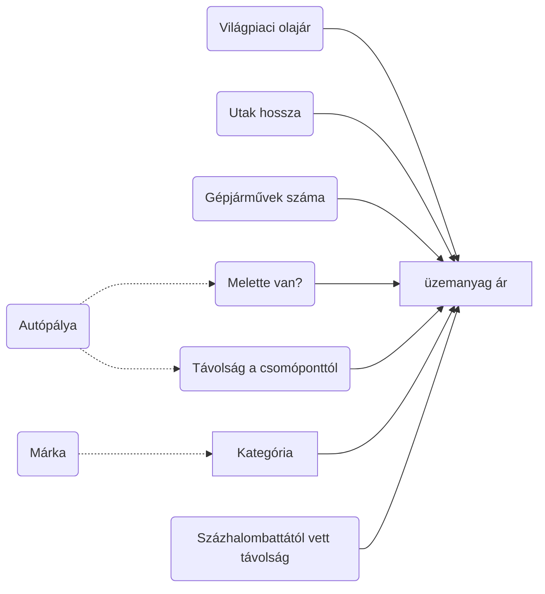

```{r setup, include=FALSE}
knitr::opts_chunk$set(
  echo = TRUE, error = TRUE, dpi = 400, fig.align = "center",
   fig.path = "figures/"
  )
```

## Casuality map


```mermaid
graph LR
  A[üzemanyag ár]
  B(Világpiaci olajár) --> A
  C(Utak hossza)-->A
  D(Gépjárművek száma)-->A
  E(Autópálya)-.->E1(Melette van?)
  E-..->E2(Távolság a csomóponttól)
  E1-->A
  E2-->A
  F(Márka)-..->G[Kategória]
  G-->A
  H(Százhalombattától vett távolság)-->A
```

