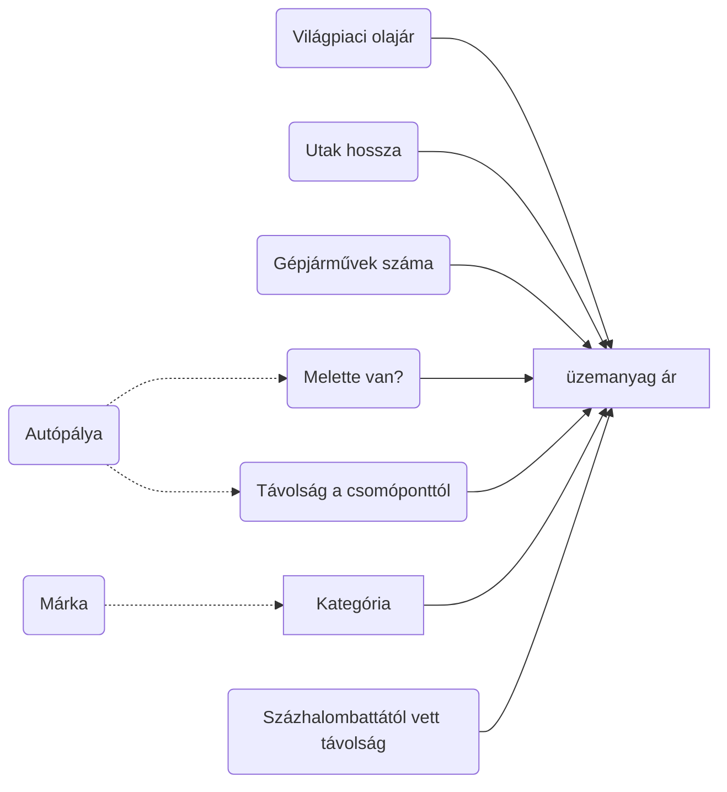

```{r setup, include=FALSE}
knitr::opts_chunk$set(
  echo = TRUE, error = TRUE, dpi = 400, fig.align = "center",
  fig.path = "figures/", dev = c("png", "pdf")
)
```

## Casuality map



```{r}
source("codes/utils.R")
load("data/fuel_df.RData")
load("data/city_df.RData")
load("data/energy_agency_df.RData")
load("data/crude_df.RData")

theme_set(
  theme_bw() + 
    theme(
      legend.position = "bottom"
    )
)
```


```{r price_control, fig.width=9}
energy_agency_df %>% 
  pivot_longer(-1, names_to = "fuel", values_to = "price") %>% 
  ggplot() + 
  geom_vline(aes(xintercept = as.Date("2021-11-15"), linetype = "Beginning of price control (2021-11-15)"), color = "orange", size = 1.5) +
  geom_line(aes(time, price, color = fuel)) +
  geom_point(aes(time, price, color = fuel), show.legend = FALSE) + 
  geom_point(data = count(fuel_df, date), aes(x = date, y = 520, fill = "Data sucessfully collected"), shape = 21, color = "purple", alpha = .5) +
  scale_fill_manual(values = "purple") +
  scale_linetype_manual(values = 2) +
  scale_x_date(breaks = scales::date_breaks("months"), labels = ~ NiceMonth(., keep_year = TRUE, label = TRUE)) + 
  labs(fill = NULL, linetype = NULL, color = "Fuel type", x = NULL, y = "Reported average fuel price (Hungrian Forint)")
```

```{r crude_price}
crude_df %>% 
  mutate(price_huf = crude_price * usd_huf) %>% 
  pivot_longer(-1) %>% 
  mutate(name = fct_inorder(name)) %>% 
  na.omit() %>% 
  ggplot(aes(time, value)) +
  facet_wrap(~ name, scales = "free_y", ncol = 1, labeller = as_labeller(c("usd_huf" = "US dollar in HUF", "crude_price" = "Crude oil price in US dollar", "price_huf" = "Crude oil price in HUF"))) + 
  geom_line() + 
  scale_x_date(breaks = scales::date_breaks("months"), labels = ~ NiceMonth(., keep_year = TRUE, label = TRUE)) + 
  labs(x = NULL, y = NULL)
```

